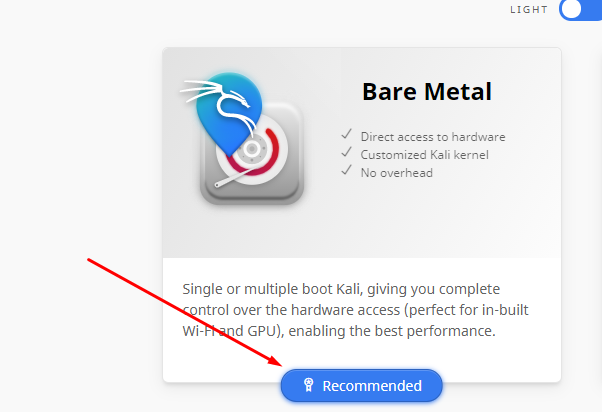
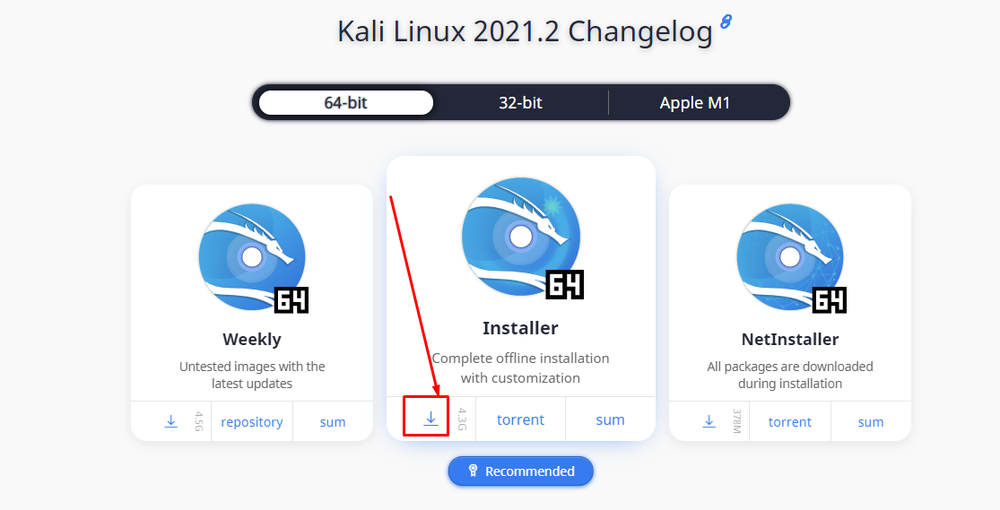
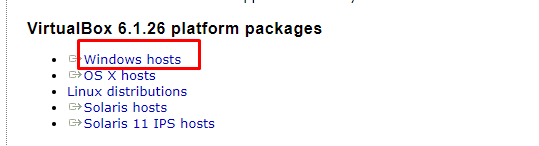
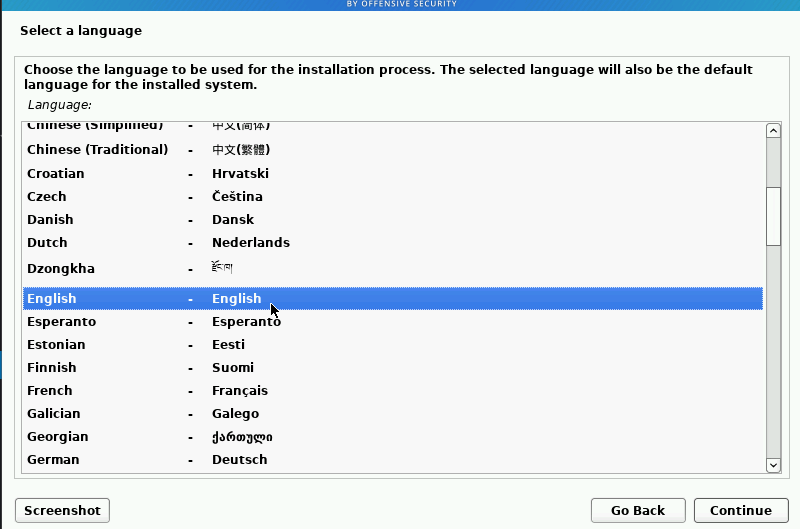
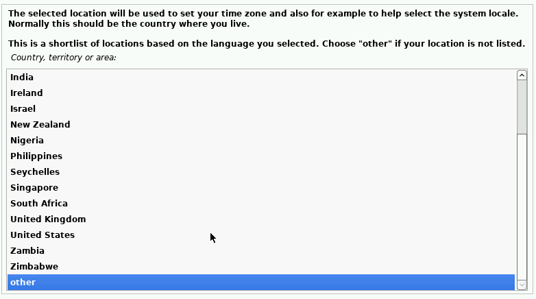
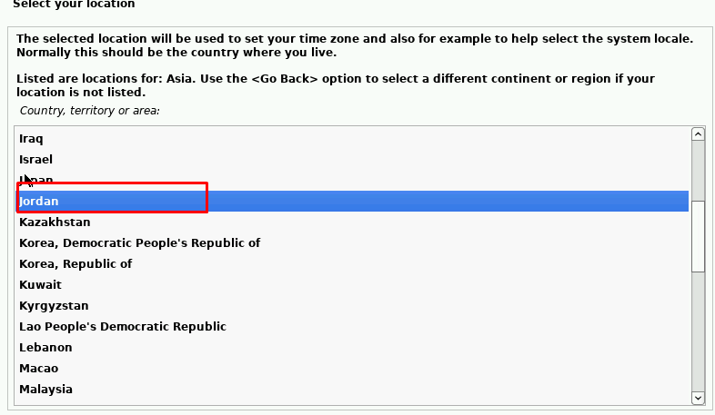
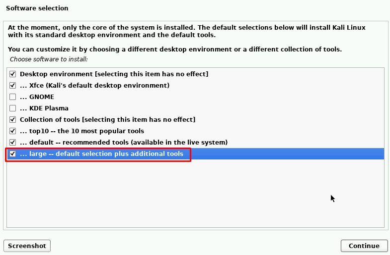
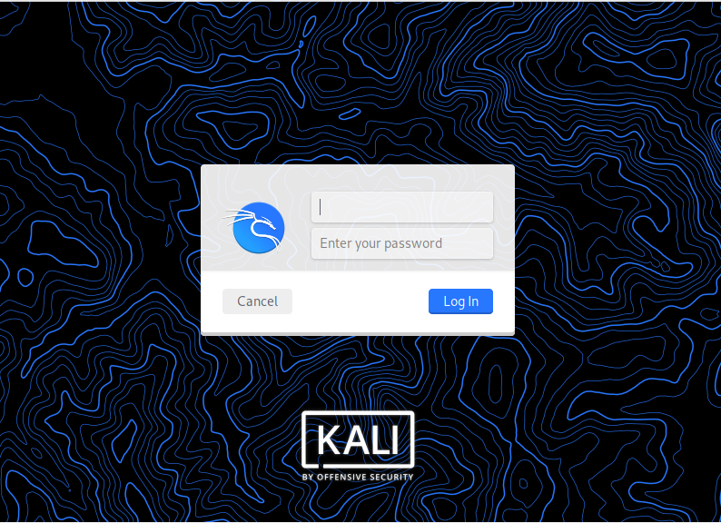

## Virtual Lap Installation

A virtual Lab is a simulated lab environment typically implemented as a software program which allows the users to perform their experiments.

### Createing TryHackMe Account

We will go to [https://tryhackme.com](https://tryhackme.com). And click to Join Now to create new account.

## Kali Linux Installtion

- Go to [https://www.kali.org/get-kali](https://www.kali.org/get-kali) and click in Recommended

- Finaly click in the download button

### Now we can dowload the VirtualBox machine

Go to [https://www.virtualbox.org/wiki/Downloads](https://www.virtualbox.org/wiki/Downloads) and click on Windows hosts

Then open the `VirtualBox-6.1.26-145957-Win` setup and download it.

## Install Kali Linux in VirtualBox

### we will change some setting in VirtualBox befor install the Kali-linux

1. Create new machine:

   - Click in `new`.
   - In the `Name` section write `Kali`.
   - In the `Type` section select `Linux`.
   - In the `Version` section select `Debian (64-bit)`.
   - Change the `1024` to `2024`.
   - Press next and in the `File location size` change the `8.00 GB` to `50.0 GB`.

2. now we must change some setting

   - Go to `Settings`.
   - In the left side go to `Storage` and press in `Controller: IDE O+` and click in `Add` then chose the `kali-linux.iso file` and press ok.
   - Go to the `Network` and select `Attached to` and choose `Bridged Adapter`.

- Note: What is `Bridged Adapter` and why we used it

Bridged Adapter This mode is used for connecting the virtual network adapter of a VM to a physical network to which a physical network adapter of the VirtualBox host machine is connected.

A VM virtual network adapter uses the host network interface for a network connection. Put simply, network packets are sent and received directly from/to the virtual network adapter without additional routing. A special net filter driver is used by VirtualBox for a bridged network mode in order to filter data from the physical network adapter of the host.

- Note: read more about the Network visit [link](https://www.nakivo.com/blog/virtualbox-network-setting-guide)

### Now we are going to install Kali-linux

1.  Click `Start`.
2.  Press in `Graphical install`.

3.  Select language:

- 
- 
- 
- 

4. In configure the network:

   - `Hostname` write `Kali`.
   - `Domainname` make it emmpty.

5. set up the users and paswords:

   - `Full name for the new user` write `anything you like`.
   - `user for the account` make it defult.
   - `password` make it `root`.

6. Partition disk:

   - `Partitioning methoud` should be `Guided-use entire disk`.
   - `Select disk to partition` make it defult.
   - `Partitioning schema` choose `All files in one partition (recommended for new users)`.
   - `write change to diske` make sure to be `Yes`.

7. Software selection: - choose software to install:
   

8. Install the GRUB boot loader
   - `Install the GRUB boot loader to your primary drive` make sure it is `Yes`.
   - `Device for boot loader installaion` choose the `/dev/sda (ata-VBOX_HARDDISK_VB894idi83-a88d4993)`.

### Now our KaliLunx are ready, make sure you have like pictuer

.

**Note:** use the username and the password that you add it in the installation.
