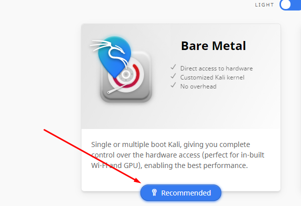

## Virtual Lap
Virtual labs are simulated learning environments that allow students to complete laboratory experiments online and explore concepts and theories without stepping into a physical science lab.

## Createing TryHackMe Account

We will go to this link [https://tryhackme.com](https://tryhackme.com). And click to Join Now to create new account.

## Kali Linux Installtion
Go to link [https://www.kali.org](https://www.kali.org) and click in Download 

then click in Recommended

