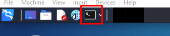
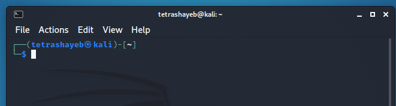
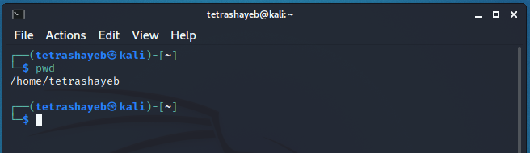
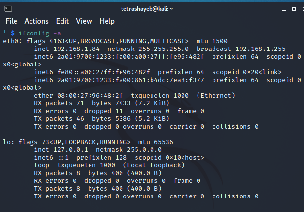
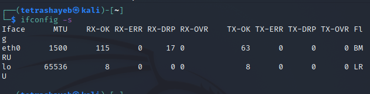
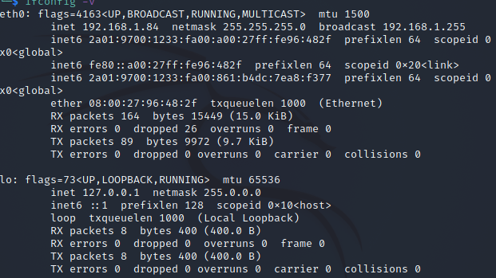

# Linux commands

## What you’ll learn

By the end of this lesson, you will be familiar with the following:

- A little history of the command line.
- How to access the command line from your own computer.
- How to perform some basic file manipulation.
- A few other useful commands.
- How to chain commands together to make more powerful tools.
- The best way to use administrator powers.

## Linux commands

The Linux command line is a text interface to your computer. Often referred to as the shell, terminal, console, prompt or various other names, it can give the appearance of being complex and confusing to use. Yet the ability to copy and paste commands from a website, combined with the power and flexibility the command line offers, means that using it may be essential when trying to follow instructions online, including many on this very website!

This lesson will teach you a little of the history of the command line, then walk you through some practical exercises to become familiar with a few basic commands and concepts. We’ll assume no prior knowledge, but by the end we hope you’ll feel a bit more comfortable the next time you’re faced with some instructions that begin “Open a terminal”.

## A brief history lesson

During the formative years of the computer industry, one of the early operating systems was called Unix. It was designed to run as a multi-user system on mainframe computers, with users connecting to it remotely via individual terminals. These terminals were pretty basic by modern standards: just a keyboard and screen, with no power to run programs locally. Instead they would just send keystrokes to the server and display any data they received on the screen. There was no mouse, no fancy graphics, not even any choice of colour. Everything was sent as text, and received as text. Obviously, therefore, any programs that ran on the mainframe had to produce text as an output and accept text as an input.

## Opean a terminal

you can find a launcher for the terminal by clicking on the Activities item at the top left of the screen, then typing the first few letters of “terminal”, “command”, “prompt” or “shell”. Yes, the developers have set up the launcher with all the most common synonyms, so you should have no problems finding it.



However you launch your terminal, you should end up with a rather dull looking window with an odd bit of text at the top, much like the image below. Depending on your Linux system the colours may not be the same, and the text will likely say something different, but the general layout of a window with a large (mostly empty) text area should be similar.



Let’s run our first command. Click the mouse into the window to make sure that’s where your keystrokes will go, then type the following command, all in lower case, before pressing the Enter or Return key to run it.

    pwd

You should see a directory path printed out (probably something like `/home/YOUR_USERNAME` , then another copy of that odd bit of text.



From the root directory, the following command will move you into the “home” directory (which is an immediate subdirectory of `/`):

    cd home
    pwd

To go up to the parent directory, in this case back to `/`, use the special syntax of two dots `..` when changing directory (note the space between `cd` and `..`, unlike in DOS you can’t just type `cd..` as one command):

    cd ..
    pwd

---

### Creating folders and files

In this section we’re going to create some real files to work with. To avoid accidentally trampling over any of your real files, we’re going to start by creating a new directory, well away from your home folder, which will serve as a safer environment in which to experiment:

```
mkdir /tmp/testing
cd /tmp/testing
```

- Notice the use of an absolute path, to make sure that we create the testing directory inside `/tmp`. Without the forward slash at the start, the `mkdir` command would try to find a `tmp` directory inside the current working directory, then try to create a testing directory inside that. If it couldn’t find a `tmp` directory, the command would fail.

In case you hadn’t guessed, `mkdir` it is short for ‘make directory’. Now that we’re safely inside our test area (double check with `pwd` if you’re not certain), let’s create a few subdirectories:

    mkdir dir1 dir2 dir3

There’s something a little different about that command. So far we’ve only seen commands that work on their own `cd, pwd` or that have a single item afterwards `cd /, cd ~/Desktop`. But this time we’ve added three things after the `mkdir` command. Those things are referred to as parameters or arguments, and different commands can accept different numbers of arguments. The `mkdir` command expects at least one argument, whereas the `cd` command can work with zero or one, but no more. See what happens when you try to pass the wrong number of parameters to a command:

```
mkdir
cd /etc ~/Desktop
```

---

### Creating files using redirection

Our demonstration folder is starting to look rather full of directories, but is somewhat lacking in files. Let’s remedy that by redirecting the output from a command so that, instead of being printed to the screen, it ends up in a new file. First, remind yourself what the `ls` command is currently showing:

    ls

Suppose we wanted to capture the output of that command as a text file that we can look at or manipulate further. All we need to do is to add the greater-than character `>` to the end of our command line, followed by the name of the file to write to:

    ls > output.txt

This time there’s nothing printed to the screen, because the output is being redirected to our file instead. If you just run `ls` on its own you should see that the `output.txt` file has been created. We can use the `cat` command to look at its content:

    cat output.txt

Okay, so it’s not exactly what was displayed on the screen previously, but it contains all the same data, and it’s in a more useful format for further processing. Let’s look at another command, `echo`:

    echo "This is a test"

Yes, `echo` just prints its arguments back out again (hence the name). But combine it with a redirect, and you’ve got a way to easily create small test files:

```
echo "This is a test" > test_1.txt
echo "This is a second test" > test_2.txt
echo "This is a third test" > test_3.txt
ls
```

You should `cat` each of these files to check their contents. But `cat` is more than just a file viewer - its name comes from ‘concatenate’, meaning “to link together”. If you pass more than one filename to, `cat` it will output each of them, one after the other, as a single block of text:

    cat test_1.txt test_2.txt test_3.txt

---

### Sudo and su commands

The `sudo` command allows you to run programs with the security privileges of another user (by default, as the superuser). It prompts you for your personal password and confirms your request to execute a command by checking a file, called `sudoers`, which the system administrator configures. Using the `sudoers` file, system administrators can give certain users or groups access to some or all commands without those users having to know the `root` password. It also logs all commands and arguments, so there is a record of who used it for what, and when.

To use the `sudo` command, at the command prompt, enter:

    sudo command

Replace `command` with the command for which you want to use `sudo`.

The `sudo` command also makes it easier to practice the principle of the least privilege (PoLP), which is a computer security concept that helps control system access and potential system exploits and compromises. For more information about the `sudo` command, visit A. P. Lawrence's Using sudo page.

**The `su` command**

The `su` command allows you to become another user. To use the `su` command on a per-command basis, enter:

    su user -c command

Replace `user` with the name of the account which you'd like to run the command as, and `command` with the command you need to run as another user. To switch users before running many commands, enter:

    su user

Replace `user` with the name of the account which you'd like to run the commands as.

The `user` feature is optional; if you don't provide a user, the `su` command defaults to the `root` account, which in Unix is the system administrator account. In either case, you'll be prompted for the password associated with the account for which you're trying to run the command. If you supply a user, you will be logged in as that account until you exit it. To do so, press `Ctrl-d` or type `exit` at the command prompt.

Using `su` creates security hazards, is potentially dangerous, and requires more administrative maintenance. It's not good practice to have numerous people knowing and using the `root` password because when logged in as `root`, you can do anything to the system. This could provide too much power for inexperienced users, who could unintentionally damage the system. Additionally, each time a user should no longer use the `root` account (for example, an employee leaves), the system administrator will have to change the `root` password.

---

### Nano editor

To edit a file using the Nano editor, enter:

     nano filename

Replace `filename` with the name of the file you want to edit; this can be an existing file or a new one that Nano will create for you. Nano will open the file, and you can then edit it much as you would a document in a word processor.

The caret (`^`) in front of the commands in the menu indicates that you should hold down the `Ctrl` key and press the corresponding letter. For example, `^A` means you should hold down the `Ctrl` key, then press `a`. (The commands are listed on the screen in uppercase letters, but you type them in lowercase.

---

### clear command

`clear` is a standard Unix computer operating system command that is used to clear the terminal screen. This command first looks for a terminal type in the environment and after that, it figures out the **term info** database for how to clear the screen. And this command will ignore any command-line parameters that may be present. Also, the `clear` command doesn’t take any argument, and it is almost similar to `cls` command on a number of other Operating Systems.

    clear

**Note:** In order to clear the terminal press **Ctrl+L**

---

### Ifconfig command

`ifconfig` (interface configuration) command is used to configure the kernel-resident network interfaces. It is used at the boot time to set up the interfaces as necessary. After that, it is usually used when needed during debugging or when you need system tuning. Also, this command is used to assign the IP address and netmask to an interface or to enable or disable a given interface.

    ifconfig [...OPTIONS] [INTERFACE]

Newer versions of some Linux distributions don’t have ifconfig command pre-installed. So, in case, there is an error **“ifconfig: command not found”**, Then execute the following command to install ifconfig.

**For Debian, Ubuntu, and related Linux distributions.**

    sudo apt-get install net-tools

This will install ifconfig along with some other networking commands like arp, route, ipmaddr.

**Options:**

- **-a :** This option is used to display all the interfaces available, even if they are down.

       ifconfig -a



- **-s :** Display a short list, instead of details.

        ifconfig -s



- **-v :** Run the command in verbose mode – log more details about execution.

        ifconfig -v



- **up :** This option is used to activate the driver for the given interface.

      ifconfig interface up

---

### nslookup command

**Nslookup** (stands for “Name Server Lookup”) is a useful command for getting information from DNS server. It is a network administration tool for querying the Domain Name System (DNS) to obtain domain name or IP address mapping or any other specific DNS record. It is also used to troubleshoot DNS related problems.

    nslookup [option]

The **nslookup** command enters interactive mode when no arguments are given, or when the first argument is a - (minus sign) and the second argument is the host name or internet address of a name server. When no arguments are given, the command queries the default name server. The **nslookup** command enters non-interactive mode when you give the name or internet address of the host to be looked up as the first argument. The optional second argument specifies the host name or address of a name server. You can specify options on the command line if they precede the arguments and are prefixed with a hyphen. For example, to change the default query type to host information, and the initial timeout to 10 seconds, enter the following command:

    nslookup -query=hinfo  -timeout=10

**host command**

**host** command in Linux system is used for DNS (Domain Name System) lookup operations. In simple words, this command is used to find the IP address of a particular domain name or if you want to find out the domain name of a particular IP address the host command becomes handy. You can also find more specific details of a domain by specifying the corresponding option along with the domain name.

    host [-aCdlriTWV] [-c class] [-N ndots] [-t type] [Wtime]
     [-R number] [-m flag] hostname [server]

**host command without any option:** It will print the general syntax of the command along with the various options that can be used with the host command as well as gives a brief description about each option.

**Different options with the host command:**

- **host domain_name:** This will print the IP address details of the specified domain.

  host example.com

- **host IP_Address:** This will display the domain details of the specified IP Address.

  host -a example.com

- **-t :** It is used to specify the type of query.

  host -t ns example.com

- **-L**: In order to list all hosts in a domain.For this command to work you need to be either an admin or a node server.

  host -l example.com
