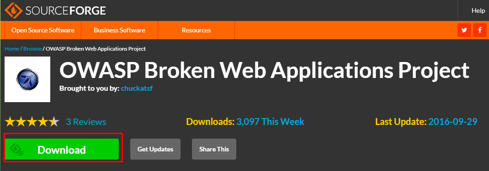
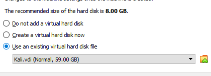
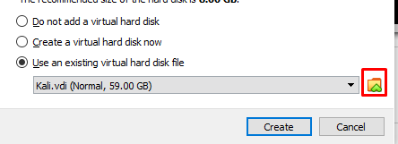
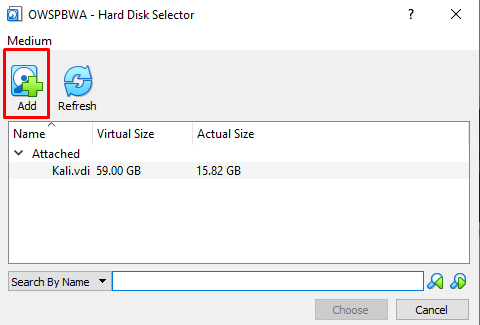
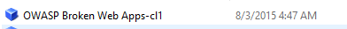

# OWASP Installtion

## Install OWASP

1. Go to [https://sourceforge.net/projects/owaspbwa](https://sourceforge.net/projects/owaspbwa).

2. Extract the file then opean your VBox.

3. Installtion steps:
- Click in `New`.
- In the `Name` write `OWSPBWA` and in the `Type` select `Linux` finaly in the `Version` choose `Other Linux (64-bit)`.
- In the `Memory size` make sure it is `1024`.
- In the `Hardesk selector` choose `Use an existing virtual hard disk file`, then do like the images:

- Select the file you are download it `OWASP_Broken_Web_Apps_VM_1.2`.

- Choose the first one `OWASP Broken Web Apps-cl1`.

- Finaly press create.

