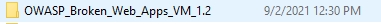

# OWASP Installtion

## High Level Goals

By the end of this lesson, you will be familiar with the following:
- OWASP
- Install OWASP

## OWASP

The Broken Web Applications (BWA) Project produces a Virtual Machine running a variety of applications with known vulnerabilities for those interested in: learning about web application security. Testing manual assessment techniques. Testing automated tools. Testing source code analysis tools.

## Install OWASP

1. Go to [https://sourceforge.net/projects/owaspbwa](https://sourceforge.net/projects/owaspbwa).

2. Extract the file then opean your VBox.

3. OWASPBWA installtion:

- Click in `New`.

- In the `Name` write `OWSPBWA` and in the `Type` select `Linux` finaly in the `Version` choose `Other Linux (64-bit)`.

- In the `Memory size` make sure it is `1024`.

- In the `Hardesk selector` choose `Use an existing virtual hard disk file`, then do like the images:

- Select the file you are download it `OWASP_Broken_Web_Apps_VM_1.2`.

- Choose the first one `OWASP Broken Web Apps-cl1`.

- Finaly press create.

4. Run the `OWASPBWA`:

- make sure the `Network` Attached to `Bridged Adapter` befor you start

- Now Click in `Start`

- You should have like this

- Now for `login` write `root` and the `password` is `owaspbwa`

- Now you can visite this IP adress `192.168.1.85` in your browser

5. Now `Start` the Kali linux with `OWASP` to check the server is runing in our kali or not

- Opean the terminal and use this command `ping 192.168.1.85`

