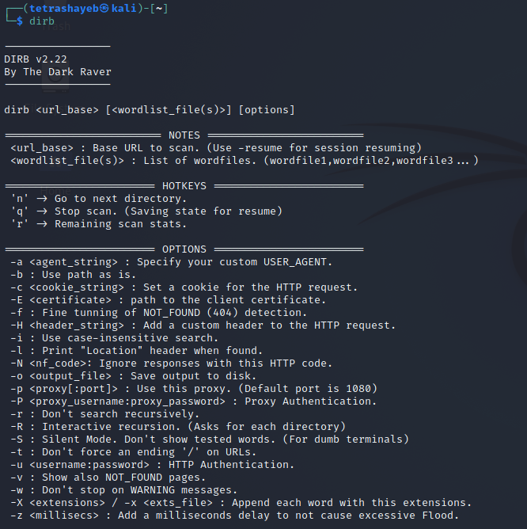
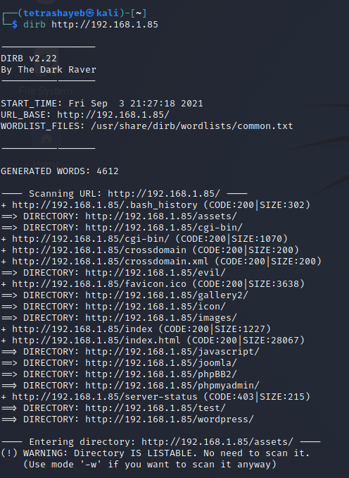
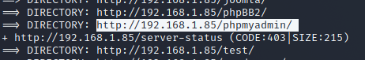
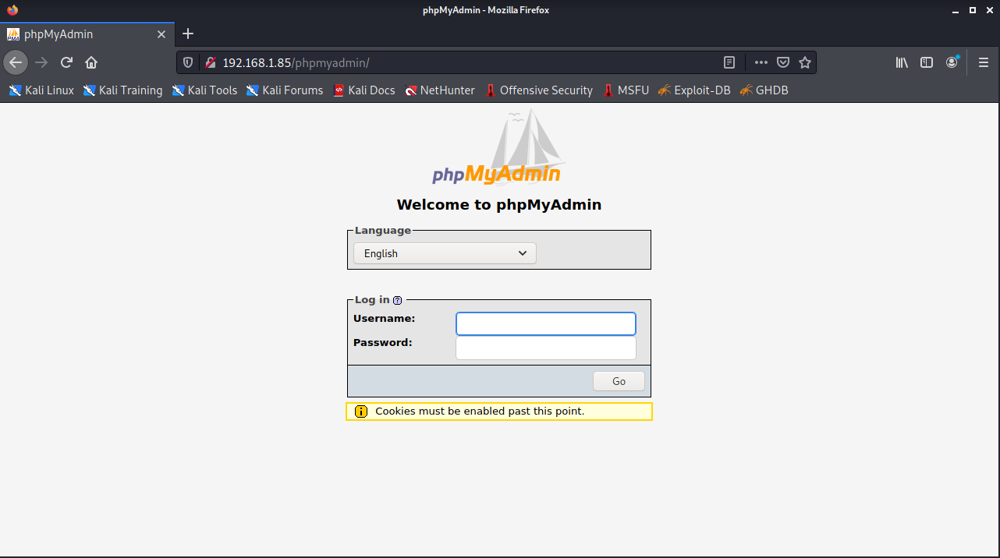
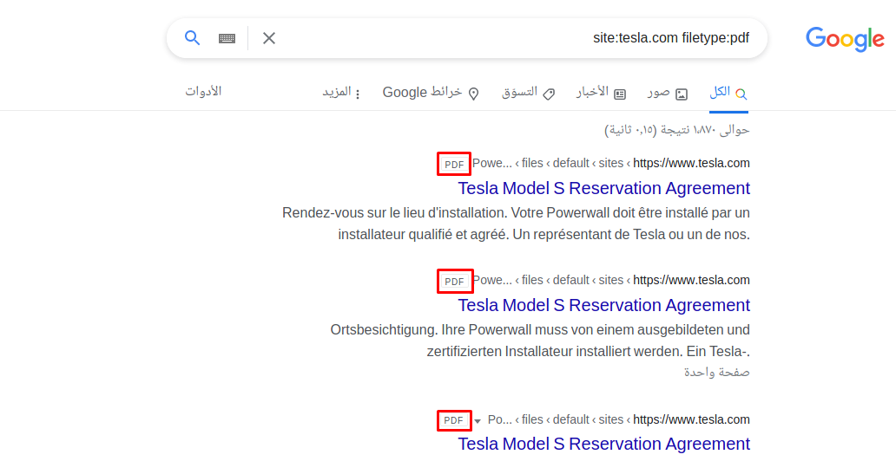
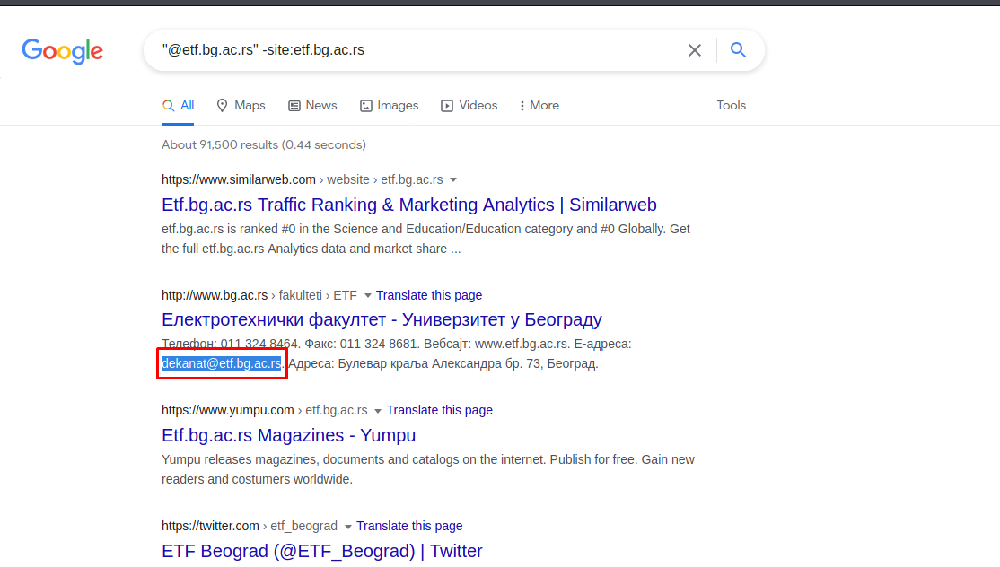
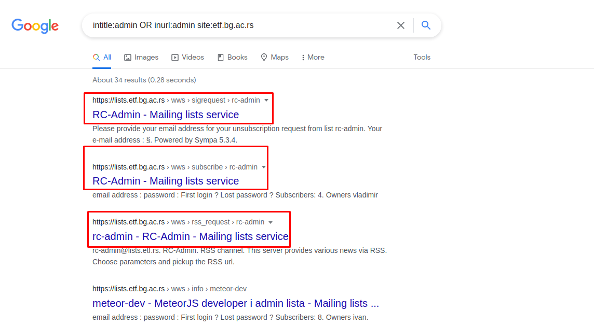
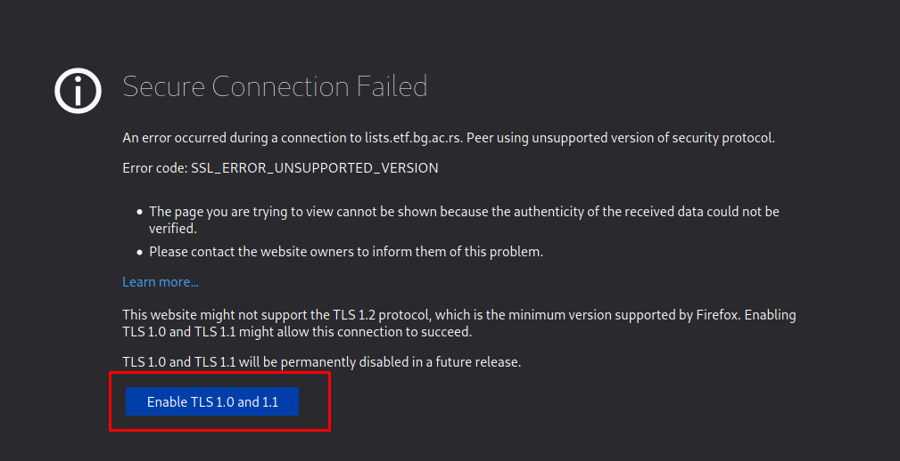
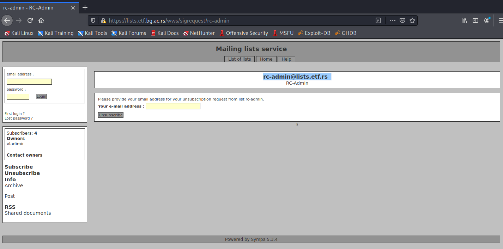
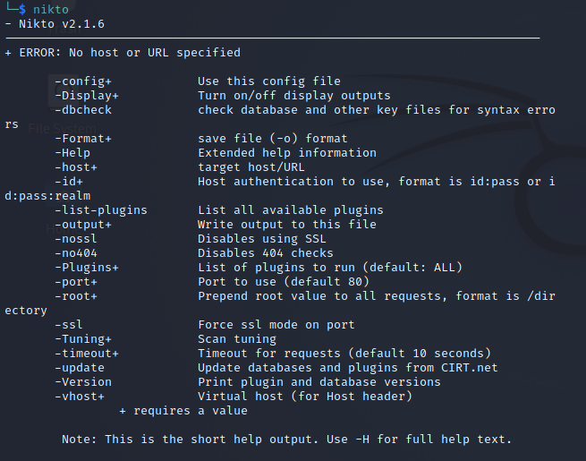

# Website Enumeration & Information Gathering

  

## High Level Goals

  

By the end of this lesons, you will be familiar with the following

  

- Drib
- Google Dorks
- Nikto
- Nmap
- Ping, Host, Nslookup
- Website Enumeration - Theory
- Whatweb

  

## Dirb

  

### What is DIRP

  

DIRB is a Web Content Scanner. It looks for existing (and/or hidden) Web Objects. It basically works by launching a dictionary based attack against a web server and analyzing the response.

  

DIRB comes with a set of preconfigured attack word lists for easy usage, but you can use your custom word lists. Also, DIRB sometimes can be used as a classic CGI scanner, but remember is a content scanner not a vulnerability scanner.

  

DIRB main purpose is to help in professional web application auditing. Specially in security related testing. It covers some holes not covered by classic web vulnerability scanners. DIRB looks for specific web objects that other generic CGI scanners can’t look for. It doesn’t search vulnerabilities nor does it look for web contents that can be vulnerable.

  

### How can we use it

  

- Open your terminal and write `dirb`

  

  

* Note: make sure you are opening your OWASP server

  

- Write this command `dirb http://192.168.1.85` to generate a dictionary from our server

  

  

- Now we can go in our browser and use any directory from the `dirb` such as let's use `http://192.168.1.58/phpmyadmin/`

  

  

and we will see this

  

  

## Google Dorks

  

### What is Google Dorks

  
  

A Google dork query, sometimes just referred to as a dork, is a search string that uses advanced search operators to find information that is not readily available on a website.

  

Google dorking, also known as Google hacking, can return information that is difficult to locate through simple search queries. That description includes information that is not intended for public viewing, but that has not been adequately protected.

  

As a passive attack method, Google dorking can return usernames and passwords, email lists, sensitive documents, personally identifiable financial information (PIFI) and website vulnerabilities. That information can be used for any number of illegal activities, including cyberterrorism, industrial espionage, identity theft and cyberstalking.

  

A search parameter is a limitation applied to a search. Here are a few examples of advanced search parameters:

  

- site: returns files located on a particular website or domain.

  

- filetype: followed (without a space) by a file extension returns files of the specified type, such as DOC, PDF, XLS and INI. Multiple file types can be searched for simultaneously by separating extensions with “|”.

  

- inurl: followed by a particular string returns results with that sequence of characters in the URL.

  

- intext: followed by the searcher’s chosen word or phrase returns files with the string anywhere in the text.

  

### How can we use it

  

1. Make sure you are opening OWASP and Kali Linux

  

2. Go to Firefox browser

  

- Then go in google and write in search, `site:tesla.com filetype:pdf` you will get all PDF result from tesla website

  

  

- Now we must find some big things like emails we can visit any website lets visit University website like [http://etf.bg.ac.rs](http://etf.bg.ac.rs) write in google search this command `"@etf.bg.ac.rs" -site:etf.bg.ac.rs`

  

  

- Let us search for slash admin directory form Google search write `intitle:admin OR inurl:admin site:etf.bg.ac.rs`

  

We got a link that we can open it that awesome now open any of these links

  

  

We got a `Secure Connection Faild` press in `Enable TLS 1.0 and 1.1`

  

  

We will go in the admin page with multiple input and one admin email

  

  

3. Not only that, but we can get a multiple commands to search in google database, go to [link](https://www.exploit-db.com/google-hacking-database)

## Nikto

### What is Nikto

Nikto is an Open Source (GPL) web server scanner which performs comprehensive tests against web servers for multiple items, including over 6700 potentially dangerous files/programs, checks for outdated versions of over 1250 servers, and version specific problems on over 270 servers. It also checks for server configuration items such as the presence of multiple index files, HTTP server options, and will attempt to identify installed web servers and software. Scan items and plugins are frequently updated and can be automatically updated.

Nikto is not designed as a stealthy tool. It will test a web server in the quickest time possible, and is obvious in log files or to an IPS/IDS. However, there is support for LibWhisker's anti-IDS methods, in case you want to give it a try (or test your IDS system).

1. Now open the terminal and write `nikto`.

	This will open the options for us 

- The most important command that is `-host` 
2. run this command to scan our OWASP machine

		nikto -host 192.168.1.85
- we got some target information 

		+ Target IP:          192.168.1.85
		+ Target Hostname:    192.168.1.85
		+ Target Port:        80
		+ Start Time:         2021-09-12 12:13:02 (GMT3)

- and the server configurations and what is the version it is using

	    + Server: Apache/2.2.14 (Ubuntu) mod_mono/2.4.3 PHP/5.3.2-1ubuntu4.30 with Suhosin-Patch proxy_html/3.0.1 mod_python/3.3.1 Python/2.6.5 mod_ssl/2.2.14 OpenSSL/0.9.8k Phusion_Passenger/4.0.38 mod_perl/2.0.4 Perl/v5.10.1
	    
- and here it's description each those version what is match to find it must be interesting for us 

		+ The anti-clickjacking X-Frame-Options header is not present.
		+ The X-XSS-Protection header is not defined. This header can hint to the user agent to protect against some forms of XSS
		+ The X-XSS-Protection header is not defined. This header can hint to the user agent to protect against some forms of XSS

- it's show for us what the HTTP methods the server is use

	    + Allowed HTTP Methods: GET, HEAD, POST, OPTIONS, TRACE
	    + OSVDB-877: HTTP TRACE method is active, suggesting the host is vulnerable to XST

- and finally that show for us outputs about what is the directors

	    + OSVDB-3092: /phpmyadmin/changelog.php: phpMyAdmin is for managing MySQL databases, and should be protected or limited to aut
	    + OSVDB-3268: /test/: Directory indexing found.
	    + OSVDB-3092: /test/: This might be interesting...
	    + OSVDB-3268: /icons/: Directory indexing found.
	    + OSVDB-3268: /images/: Directory indexing found.
		+ OSVDB-3233: /icons/README: Apache default file found.
		+ /phpmyadmin/: phpMyAdmin directory found
		+ OSVDB-3092: /phpmyadmin/Documentation.html: phpMyAdmin is for managing MySQL databases, and should be protected or limited t

3. We can scan with the `-port` to know what the directors are open that port 
Write this command `nikto -host 192.168.1.85 -port 8081`
you will get some result that we know it like

	    + The X-XSS-Protection header is not defined. This header can hint to the 			 user agent to protect against some forms of XSS
		+ The X-XSS-Protection header is not defined. This header can hint to the user agent to protect against some forms of XSS

    but we got some interesting directors like

    + OSVDB-3092: /admin/: This might be interesting...
    + OSVDB-3092: /css/: This might be interesting...
    + /admin/index.html: Admin login page/section found.

  

**Note:** you can read more about **Nikto**, visit [link](https://tools.kali.org/information-gathering/nikto).