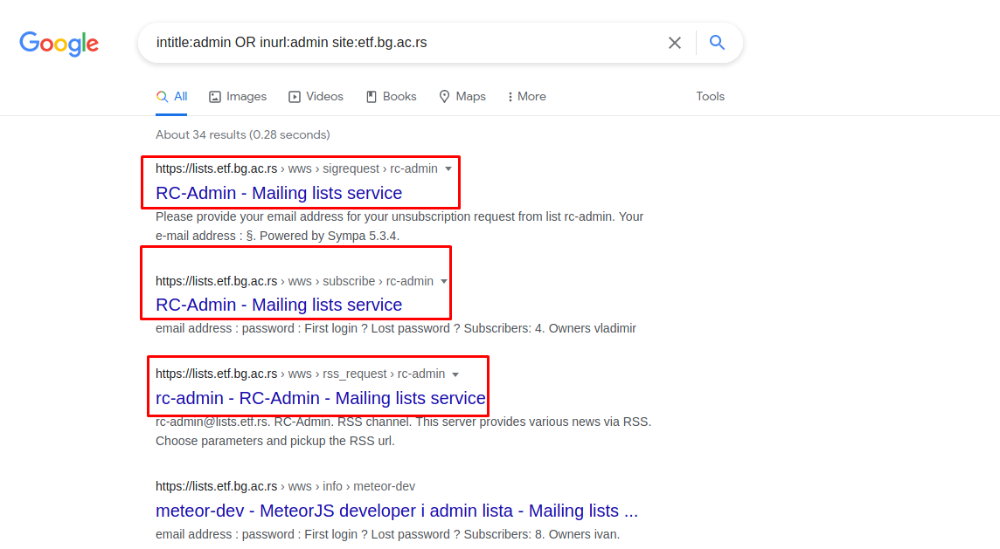

# Website Enumeration & Information Gathering

## Google Dorks
  
### What is Google Dorks
  
  
A Google dork query, sometimes just referred to as a dork, is a search string that uses advanced search operators to find information that is not readily available on a website.
  
Google dorking, also known as Google hacking, can return information that is difficult to locate through simple search queries. That description includes information that is not intended for public viewing, but that has not been adequately protected.
  
As a passive attack method, Google dorking can return usernames and passwords, email lists, sensitive documents, personally identifiable financial information (PIFI) and website vulnerabilities. That information can be used for any number of illegal activities, including cyberterrorism, industrial espionage, identity theft and cyberstalking.
  
A search parameter is a limitation applied to a search. Here are a few examples of advanced search parameters:
  
- site: returns files located on a particular website or domain.
  
- filetype: followed (without a space) by a file extension returns files of the specified type, such as DOC, PDF, XLS and INI. Multiple file types can be searched for simultaneously by separating extensions with “|”.
  
- inurl: followed by a particular string returns results with that sequence of characters in the URL.
  
- intext: followed by the searcher’s chosen word or phrase returns files with the string anywhere in the text.
  
### How can we use it
  
1. Make sure you are opening OWASP and Kali Linux
  
2. Go to Firefox browser
  
- Then go in google and write in search, `site:tesla.com filetype:pdf` you will get all PDF result from tesla website
  

  
- Now we must find some big things like emails we can visit any website lets visit University website like [http://etf.bg.ac.rs](http://etf.bg.ac.rs) write in google search this command `"@etf.bg.ac.rs" -site:etf.bg.ac.rs`
  

  
- Let us search for slash admin directory form Google search write `intitle:admin OR inurl:admin site:etf.bg.ac.rs`
  
We got a link that we can open it that awesome now open any of these links
  

  
We got a `Secure Connection Faild` press in `Enable TLS 1.0 and 1.1`
  

  
We will go in the admin page with multiple input and one admin email
  

  
3. Not only that, but we can get a multiple commands to search in google database, go to [link](https://www.exploit-db.com/google-hacking-database)