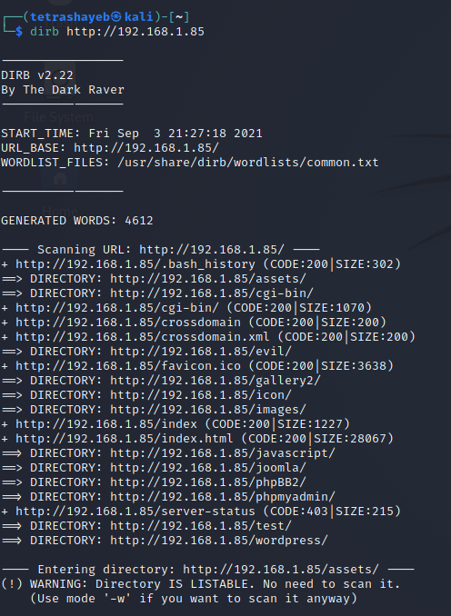

# Website Enumeration & Information Gathering

## 4. Dirb

### What is DIRP

DIRB is a Web Content Scanner. It looks for existing (and/or hidden) Web Objects. It basically works by launching a dictionary based attack against a web server and analyzing the response.

DIRB comes with a set of preconfigured attack word lists for easy usage, but you can use your custom word lists. Also, DIRB sometimes can be used as a classic CGI scanner, but remember is a content scanner not a vulnerability scanner.

DIRB main purpose is to help in professional web application auditing. Specially in security related testing. It covers some holes not covered by classic web vulnerability scanners. DIRB looks for specific web objects that other generic CGI scanners can’t look for. It doesn’t search vulnerabilities nor does it look for web contents that can be vulnerable.

### How can we use it

- Open your terminal and write `dirb`

- Note: make sure you are opening your OWASP server

* Write this command `dirb http://192.168.1.85` to generate a dictionary from our server

- Now we can go in our browser and use any directory from the `dirb` such as let's use `http://192.168.1.58/phpmyadmin/`

and we will see this

