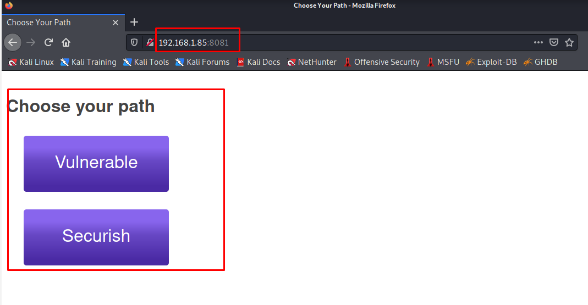

# Website Enumeration & Information Gathering

## 4. Nmap
**What is Nmap**

Nmap ("Network Mapper") is a free and open source utility for network discovery and security auditing. Many systems and network administrators also find it useful for tasks such as network inventory, managing service upgrade schedules, and monitoring host or service uptime. Nmap uses raw IP packets in novel ways to determine what hosts are available on the network, what services (application name and version) those hosts are offering, what operating systems (and OS versions) they are running, what type of packet filters/firewalls are in use, and dozens of other characteristics. It was designed to rapidly scan large networks, but works fine against single hosts. Nmap runs on all major computer operating systems, and official binary packages are available for Linux, Windows, and Mac OS X. In addition to the classic command-line Nmap executable, the Nmap suite includes an advanced GUI and results viewer a flexible data transfer, redirection, and debugging tool a utility for comparing scan results, and a packet generation and response analysis tool.

- Lets learn how to use the `nmap` by running this command 

	    nmap --help
you will see the options of `nmap ` tools

- we will do the basics scan in `nmap` just to see what the output we will get and what these tools do for us.
 Let's scan our target by using this command `nmap 192.168.1.85`

		$  nmap 192.168.1.85
		Starting Nmap 7.91 ( https://nmap.org ) at 2021-09-14 13:59 EEST
		Stats: 0:00:00 elapsed; 0 hosts completed (0 up), 1 undergoing Ping Scan
		Ping Scan Timing: About 100.00% done; ETC: 13:59 (0:00:00 remaining)
		Nmap scan report for owaspbwa.home (192.168.1.85)
		Host is up (0.00055s latency).
		Not shown: 991 closed ports
		PORT     STATE SERVICE
		22/tcp   open  ssh
		80/tcp   open  http
		139/tcp  open  netbios-ssn
		143/tcp  open  imap
		443/tcp  open  https
		445/tcp  open  microsoft-ds
		5001/tcp open  commplex-link
		8080/tcp open  http-proxy
		8081/tcp open  blackice-icecap

		Nmap done: 1 IP address (1 host up) scanned in 0.14 seconds
only output we will get it's which port is open, so we have port `22/tcp` which running  service `ssh`,  we got other website hosted on port `80/tcp` which running  the  service `http` and we get other website open on `443/tcp` which is  running service  `https`, but we do also get some others port open that running other service, so that is also `nmap` is useful, perhaps sometimes ones when you scan the website you will discover other ports that the machine hosting other service that parable has different pack.

So that is the basics scan that we did, but it's `Not shown: 991 closed ports` why is that? Will **Nmap** by default scan most known one thousand port, in our scan that have 991 closed ports while these 9 ports are opens.

If you want to know more ports that open with other service write this command, `nmap -sV 192.168.1.85` that is the output we  will get

	$ nmap -sV 192.168.1.85                                                                                                                              130 ⨯
	Starting Nmap 7.91 ( https://nmap.org ) at 2021-09-14 14:33 EEST
	Nmap scan report for owaspbwa.home (192.168.1.85)
	Host is up (0.00037s latency).
	Not shown: 991 closed ports
	PORT     STATE SERVICE     VERSION
	22/tcp   open  ssh         OpenSSH 5.3p1 Debian 3ubuntu4 (Ubuntu Linux; protocol 2.0)
	80/tcp   open  http        Apache httpd 2.2.14 ((Ubuntu) mod_mono/2.4.3 PHP/5.3.2-1ubuntu4.30 with Suhosin-Patch proxy_html/3.0.1 mod_python/3.3.1 Python/2.6.5 mod_ssl/2.2.14 OpenSSL...)
	139/tcp  open  netbios-ssn Samba smbd 3.X - 4.X (workgroup: WORKGROUP)
	143/tcp  open  imap        Courier Imapd (released 2008)
	443/tcp  open  ssl/https?
	445/tcp  open  netbios-ssn Samba smbd 3.X - 4.X (workgroup: WORKGROUP)
	5001/tcp open  java-object Java Object Serialization
	8080/tcp open  http        Apache Tomcat/Coyote JSP engine 1.1
	8081/tcp open  http        Jetty 6.1.25
	1 service unrecognized despite returning data. If you know the service/version, please submit the following fingerprint at https://nmap.org/cgi-bin/submit.cgi?new-service :
	SF-Port5001-TCP:V=7.91%I=7%D=9/14%Time=61408894%P=x86_64-pc-linux-gnu%r(NU
	SF:LL,4,"\xac\xed\0\x05");
	Service Info: OS: Linux; CPE: cpe:/o:linux:linux_kernel

	Service detection performed. Please report any incorrect results at https://nmap.org/submit/ .
	Nmap done: 1 IP address (1 host up) scanned in 14.09 seconds
it's looks like our firs scan, but it's larger than last one, we have another suctions `VERSION` it's give us the version of each service that is found and open port for example if we look at ssh it is running in port `80/tcp` you got an exact ssh version `OpenSSH 5.3p1 Debian 3ubuntu4 (Ubuntu Linux; protocol 2.0)`.

And if we see the `http` is running in other ports `8080/tcp` that version `Apache Tomcat/Coyote JSP engine 1.1` and the port `8081/tcp` with the version `Jetty 6.1.25` now this is sorting we didn't know before now if we go to Firefox  and try to visit our OWASP virtual machine by typing this `192.168.1.85:8081`  wow we just open another web page 

