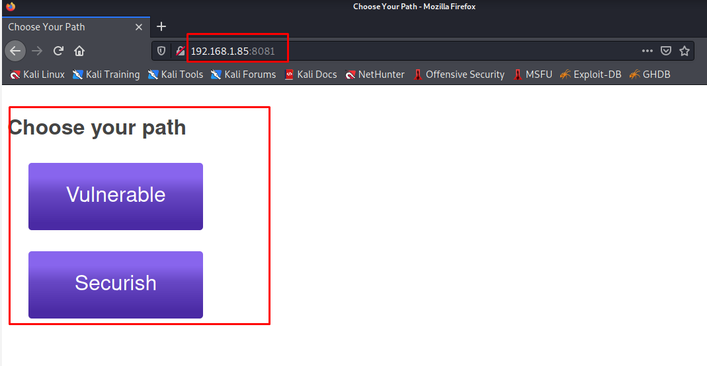

# Website Enumeration & Information Gathering

## 4. Nmap

**What is Nmap**

Nmap ("Network Mapper") is a free and open source utility for network discovery and security auditing. Many systems and network administrators also find it useful for tasks such as network inventory, managing service upgrade schedules, and monitoring host or service uptime. Nmap uses raw IP packets in novel ways to determine what hosts are available on the network, what services (application name and version) those hosts are offering, what operating systems (and OS versions) they are running, what type of packet filters/firewalls are in use, and dozens of other characteristics. It was designed to rapidly scan large networks, but works fine against single hosts. Nmap runs on all major computer operating systems, and official binary packages are available for Linux, Windows, and Mac OS X. In addition to the classic command-line Nmap executable, the Nmap suite includes an advanced GUI and results viewer a flexible data transfer, redirection, and debugging tool a utility for comparing scan results, and a packet generation and response analysis tool.

- Lets learn how to use `nmap` by running this command

          nmap --help

  you will see options of `nmap ` tools

- we will do the basics scan in `nmap` just to see what the output we will get and what these tools do for us.
  Let's scan our target by using this command `nmap 192.168.1.85`

      	$  nmap 192.168.1.85
      	Starting Nmap 7.91 ( https://nmap.org ) at 2021-09-14 13:59 EEST
      	Stats: 0:00:00 elapsed; 0 hosts completed (0 up), 1 undergoing Ping Scan
      	Ping Scan Timing: About 100.00% done; ETC: 13:59 (0:00:00 remaining)
      	Nmap scan report for owaspbwa.home (192.168.1.85)
      	Host is up (0.00055s latency).
      	Not shown: 991 closed ports
      	PORT     STATE SERVICE
      	22/tcp   open  ssh
      	80/tcp   open  http
      	139/tcp  open  netbios-ssn
      	143/tcp  open  imap
      	443/tcp  open  https
      	445/tcp  open  microsoft-ds
      	5001/tcp open  commplex-link
      	8080/tcp open  http-proxy
      	8081/tcp open  blackice-icecap

      	Nmap done: 1 IP address (1 host up) scanned in 0.14 seconds

  only output we will get it's which port is open, so we have port `22/tcp` which running service `ssh`, we got other website hosted on port `80/tcp` which running the service `http` and we get other website open on `443/tcp` which is running service `https`, but we do also get some others port open that running other service, so that is also `nmap` is useful, perhaps sometimes ones when you scan the website you will discover other ports that the machine hosting other service that parable has different pack.

So that is the basics scan that we did, but it's `Not shown: 991 closed ports` why is that? Will **Nmap** by default scan most known one thousand port, in our scan that have 991 closed ports while these 9 ports are opens.

If you want to know more ports that open with other service write this command, `nmap -sV 192.168.1.85` that is the output we will get

    $ nmap -sV 192.168.1.85                                                                                                                              130 ⨯
    Starting Nmap 7.91 ( https://nmap.org ) at 2021-09-14 14:33 EEST
    Nmap scan report for owaspbwa.home (192.168.1.85)
    Host is up (0.00037s latency).
    Not shown: 991 closed ports
    PORT     STATE SERVICE     VERSION
    22/tcp   open  ssh         OpenSSH 5.3p1 Debian 3ubuntu4 (Ubuntu Linux; protocol 2.0)
    80/tcp   open  http        Apache httpd 2.2.14 ((Ubuntu) mod_mono/2.4.3 PHP/5.3.2-1ubuntu4.30 with Suhosin-Patch proxy_html/3.0.1 mod_python/3.3.1 Python/2.6.5 mod_ssl/2.2.14 OpenSSL...)
    139/tcp  open  netbios-ssn Samba smbd 3.X - 4.X (workgroup: WORKGROUP)
    143/tcp  open  imap        Courier Imapd (released 2008)
    443/tcp  open  ssl/https?
    445/tcp  open  netbios-ssn Samba smbd 3.X - 4.X (workgroup: WORKGROUP)
    5001/tcp open  java-object Java Object Serialization
    8080/tcp open  http        Apache Tomcat/Coyote JSP engine 1.1
    8081/tcp open  http        Jetty 6.1.25
    1 service unrecognized despite returning data. If you know the service/version, please submit the following fingerprint at https://nmap.org/cgi-bin/submit.cgi?new-service :
    SF-Port5001-TCP:V=7.91%I=7%D=9/14%Time=61408894%P=x86_64-pc-linux-gnu%r(NU
    SF:LL,4,"\xac\xed\0\x05");
    Service Info: OS: Linux; CPE: cpe:/o:linux:linux_kernel

    Service detection performed. Please report any incorrect results at https://nmap.org/submit/ .
    Nmap done: 1 IP address (1 host up) scanned in 14.09 seconds

it's looks like our firs scan, but it's larger than last one, we have another suctions `VERSION` it's give us the version of each service that is found and open port for example if we look at ssh it is running in port `80/tcp` you got an exact ssh version `OpenSSH 5.3p1 Debian 3ubuntu4 (Ubuntu Linux; protocol 2.0)`.

And if we see the `http` is running in other ports `8080/tcp` that version `Apache Tomcat/Coyote JSP engine 1.1` and the port `8081/tcp` with the version `Jetty 6.1.25` now this is sorting we didn't know before now if we go to Firefox and try to visit our OWASP virtual machine by typing this `192.168.1.85:8081` wow we just open another web page

**Nmap Scripting Engine (NSE)**

The Nmap Scripting Engine (NSE) is one of Nmap's most powerful and flexible features. It allows users to write (and share) simple scripts (using the Lua programming language ) to automate a wide variety of networking tasks. Those scripts are executed in parallel with the speed and efficiency you expect from Nmap. Users can rely on the growing and diverse set of scripts distributed with Nmap, or write their own to meet custom needs.

How can we use nmap scripting, let's use this command

    nmap --script vuln 192.168.1.85

What is **vuln**
The “vuln” category will run a series of scripts which look for known issues on the target system.
There are the all scripting

    $ nmap --script vuln 192.168.1.85
    Starting Nmap 7.91 ( https://nmap.org ) at 2021-09-16 11:55 EEST
    Pre-scan script results:
    | broadcast-avahi-dos:
    |   Discovered hosts:
    |     224.0.0.251
    |   After NULL UDP avahi packet DoS (CVE-2011-1002).
    |_  Hosts are all up (not vulnerable).
    Nmap scan report for owaspbwa.home (192.168.1.85)
    Host is up (0.00057s latency).
    Not shown: 991 closed ports
    PORT     STATE SERVICE
    22/tcp   open  ssh
    80/tcp   open  http
    | http-cross-domain-policy:
    |   VULNERABLE:
    |   Cross-domain and Client Access policies.
    |     State: VULNERABLE
    |       A cross-domain policy file specifies the permissions that a web client such as Java, Adobe Flash, Adobe Reader,
    |       etc. use to access data across different domains. A client acces policy file is similar to cross-domain policy
    |       but is used for M$ Silverlight applications. Overly permissive configurations enables Cross-site Request
    |       Forgery attacks, and may allow third parties to access sensitive data meant for the user.
    |     Check results:
    |       /crossdomain.xml:
    |         <?xml version="1.0"?>
    |         <!DOCTYPE cross-domain-policy SYSTEM "http://www.macromedia.com/xml/dtds/cross-domain-policy.dtd">
    |         <cross-domain-policy>
    |           <allow-access-from domain="*" />
    |         </cross-domain-policy>
    |     Extra information:
    |       Trusted domains:*
    |
    |     References:
    |       https://www.owasp.org/index.php/Test_RIA_cross_domain_policy_%28OTG-CONFIG-008%29
    |       http://gursevkalra.blogspot.com/2013/08/bypassing-same-origin-policy-with-flash.html
    |       https://www.adobe.com/devnet-docs/acrobatetk/tools/AppSec/CrossDomain_PolicyFile_Specification.pdf
    |       https://www.adobe.com/devnet/articles/crossdomain_policy_file_spec.html
    |       http://acunetix.com/vulnerabilities/web/insecure-clientaccesspolicy-xml-file
    |_      http://sethsec.blogspot.com/2014/03/exploiting-misconfigured-crossdomainxml.html
    | http-csrf:
    | Spidering limited to: maxdepth=3; maxpagecount=20; withinhost=owaspbwa.home
    |   Found the following possible CSRF vulnerabilities:
    |
    |     Path: http://owaspbwa.home:80/railsgoat/
    |     Form id:
    |     Form action: /railsgoat/signup
    |
    |     Path: http://owaspbwa.home:80/railsgoat/
    |     Form id:
    |     Form action: /railsgoat/login
    |
    |     Path: http://owaspbwa.home:80/railsgoat/
    |     Form id: show_creds_btn
    |     Form action: #myModalLabel1
    |
    |     Path: http://owaspbwa.home:80/wordpress/
    |     Form id: searchform
    |     Form action: http://owaspbwa.home/wordpress/
    |
    |     Path: http://owaspbwa.home:80/gallery2/main.php
    |     Form id: search_searchblock
    |     Form action: main.php
    |
    |     Path: http://owaspbwa.home:80/ghost/
    |     Form id:
    |     Form action: submit.php
    |
    |     Path: http://owaspbwa.home:80/shepherd/login.jsp
    |     Form id:
    |     Form action: login
    |
    |     Path: http://owaspbwa.home:80/dom-xss-example.html
    |     Form id:
    |_    Form action: '+location.href+'
    | http-dombased-xss:
    | Spidering limited to: maxdepth=3; maxpagecount=20; withinhost=owaspbwa.home
    |   Found the following indications of potential DOM based XSS:
    |
    |     Source: document.write('<FORM METHOD="GET" ACTION="'+location.href+'">Enter your name:<input name="name"><input type="submit" value="Submit"></form>')
    |     Pages: http://owaspbwa.home:80/dom-xss-example.html
    |
    |     Source: document.write("Hello, " + document.URL.substring(pos,document.URL.length)
    |_    Pages: http://owaspbwa.home:80/dom-xss-example.html
    | http-enum:
    |   /wordpress/: Blog
    |   /test/: Test page
    |   /mono/: Mono
    |   /crossdomain.xml: Adobe Flash crossdomain policy
    |   /phpmyadmin/: phpMyAdmin
    |   /wordpress/wp-login.php: Wordpress login page.
    |   /cgi-bin/: Potentially interesting folder w/ directory listing
    |   /icons/: Potentially interesting folder w/ directory listing
    |_  /images/: Potentially interesting folder w/ directory listing
    | http-internal-ip-disclosure:
    |_  Internal IP Leaked: 127.0.1.1
    | http-sql-injection:
    |   Possible sqli for queries:
    |     http://owaspbwa.home:80/railsgoat/assets/jquery.js?body=1%27%20OR%20sqlspider
    |     http://owaspbwa.home:80/mutillidae/index.php?page=%2fowaspbwa%2fmutillidae-git%2fhome.php&do=toggle-enforce-ssl%27%20OR%20sqlspider
    |     http://owaspbwa.home:80/mutillidae/index.php?page=%2fowaspbwa%2fmutillidae-git%2fhome.php&do=toggle-bubble-hints%27%20OR%20sqlspider
    |     http://owaspbwa.home:80/mutillidae/includes/pop-up-help-context-generator.php?pagename=%2fowaspbwa%2fmutillidae-git%2fhome.php%27%20OR%20sqlspider
    |     http://owaspbwa.home:80/mutillidae/index.php?page=home.php&popUpNotificationCode=HPH0%27%20OR%20sqlspider
    |     http://owaspbwa.home:80/mutillidae/index.php?page=%2fowaspbwa%2fmutillidae-git%2fhome.php&do=toggle-security%27%20OR%20sqlspider
    |_    http://owaspbwa.home:80/mutillidae/index.php?page=%2fowaspbwa%2fmutillidae-git%2fhome.php&do=toggle-hints%27%20OR%20sqlspider
    |_http-stored-xss: Couldn't find any stored XSS vulnerabilities.
    |_http-trace: TRACE is enabled
    | http-vuln-cve2011-3192:
    |   VULNERABLE:
    |   Apache byterange filter DoS
    |     State: VULNERABLE
    |     IDs:  CVE:CVE-2011-3192  BID:49303
    |       The Apache web server is vulnerable to a denial of service attack when numerous
    |       overlapping byte ranges are requested.
    |     Disclosure date: 2011-08-19
    |     References:
    |       https://www.securityfocus.com/bid/49303
    |       https://cve.mitre.org/cgi-bin/cvename.cgi?name=CVE-2011-3192
    |       https://www.tenable.com/plugins/nessus/55976
    |_      https://seclists.org/fulldisclosure/2011/Aug/175
    139/tcp  open  netbios-ssn
    143/tcp  open  imap
    |_sslv2-drown:
    443/tcp  open  https
    |_http-aspnet-debug: ERROR: Script execution failed (use -d to debug)
    |_http-csrf: Couldn't find any CSRF vulnerabilities.
    |_http-dombased-xss: Couldn't find any DOM based XSS.
    | http-slowloris-check:
    |   VULNERABLE:
    |   Slowloris DOS attack
    |     State: LIKELY VULNERABLE
    |     IDs:  CVE:CVE-2007-6750
    |       Slowloris tries to keep many connections to the target web server open and hold
    |       them open as long as possible.  It accomplishes this by opening connections to
    |       the target web server and sending a partial request. By doing so, it starves
    |       the http server's resources causing Denial Of Service.
    |
    |     Disclosure date: 2009-09-17
    |     References:
    |       http://ha.ckers.org/slowloris/
    |_      https://cve.mitre.org/cgi-bin/cvename.cgi?name=CVE-2007-6750
    |_http-stored-xss: Couldn't find any stored XSS vulnerabilities.
    |_http-vuln-cve2014-3704: ERROR: Script execution failed (use -d to debug)
    | ssl-ccs-injection:
    |   VULNERABLE:
    |   SSL/TLS MITM vulnerability (CCS Injection)
    |     State: VULNERABLE
    |     Risk factor: High
    |       OpenSSL before 0.9.8za, 1.0.0 before 1.0.0m, and 1.0.1 before 1.0.1h
    |       does not properly restrict processing of ChangeCipherSpec messages,
    |       which allows man-in-the-middle attackers to trigger use of a zero
    |       length master key in certain OpenSSL-to-OpenSSL communications, and
    |       consequently hijack sessions or obtain sensitive information, via
    |       a crafted TLS handshake, aka the "CCS Injection" vulnerability.
    |
    |     References:
    |       https://cve.mitre.org/cgi-bin/cvename.cgi?name=CVE-2014-0224
    |       http://www.cvedetails.com/cve/2014-0224
    |_      http://www.openssl.org/news/secadv_20140605.txt
    | ssl-dh-params:
    |   VULNERABLE:
    |   Diffie-Hellman Key Exchange Insufficient Group Strength
    |     State: VULNERABLE
    |       Transport Layer Security (TLS) services that use Diffie-Hellman groups
    |       of insufficient strength, especially those using one of a few commonly
    |       shared groups, may be susceptible to passive eavesdropping attacks.
    |     Check results:
    |       WEAK DH GROUP 1
    |             Cipher Suite: TLS_DHE_RSA_WITH_3DES_EDE_CBC_SHA
    |             Modulus Type: Safe prime
    |             Modulus Source: mod_ssl 2.2.x/1024-bit MODP group with safe prime modulus
    |             Modulus Length: 1024
    |             Generator Length: 8
    |             Public Key Length: 1024
    |     References:
    |_      https://weakdh.org
    | ssl-poodle:
    |   VULNERABLE:
    |   SSL POODLE information leak
    |     State: VULNERABLE
    |     IDs:  CVE:CVE-2014-3566  BID:70574
    |           The SSL protocol 3.0, as used in OpenSSL through 1.0.1i and other
    |           products, uses nondeterministic CBC padding, which makes it easier
    |           for man-in-the-middle attackers to obtain cleartext data via a
    |           padding-oracle attack, aka the "POODLE" issue.
    |     Disclosure date: 2014-10-14
    |     Check results:
    |       TLS_RSA_WITH_AES_128_CBC_SHA
    |     References:
    |       https://www.securityfocus.com/bid/70574
    |       https://cve.mitre.org/cgi-bin/cvename.cgi?name=CVE-2014-3566
    |       https://www.imperialviolet.org/2014/10/14/poodle.html
    |_      https://www.openssl.org/~bodo/ssl-poodle.pdf
    |_sslv2-drown:
    445/tcp  open  microsoft-ds
    5001/tcp open  commplex-link
    8080/tcp open  http-proxy
    | http-enum:
    |   /examples/: Sample scripts
    |   /manager/html/upload: Apache Tomcat (401 Unauthorized)
    |   /manager/html: Apache Tomcat (401 Unauthorized)
    |_  /docs/: Potentially interesting folder
    | http-slowloris-check:
    |   VULNERABLE:
    |   Slowloris DOS attack
    |     State: LIKELY VULNERABLE
    |     IDs:  CVE:CVE-2007-6750
    |       Slowloris tries to keep many connections to the target web server open and hold
    |       them open as long as possible.  It accomplishes this by opening connections to
    |       the target web server and sending a partial request. By doing so, it starves
    |       the http server's resources causing Denial Of Service.
    |
    |     Disclosure date: 2009-09-17
    |     References:
    |       http://ha.ckers.org/slowloris/
    |_      https://cve.mitre.org/cgi-bin/cvename.cgi?name=CVE-2007-6750
    8081/tcp open  blackice-icecap

    Host script results:
    |_samba-vuln-cve-2012-1182: Could not negotiate a connection:SMB: ERROR: Server returned less data than it was supposed to (one or more fields are missing); aborting [14]
    |_smb-vuln-ms10-054: false
    |_smb-vuln-ms10-061: Could not negotiate a connection:SMB: ERROR: Server returned less data than it was supposed to (one or more fields are missing); aborting [14]
    | smb-vuln-regsvc-dos:
    |   VULNERABLE:
    |   Service regsvc in Microsoft Windows systems vulnerable to denial of service
    |     State: VULNERABLE
    |       The service regsvc in Microsoft Windows 2000 systems is vulnerable to denial of service caused by a null deference
    |       pointer. This script will crash the service if it is vulnerable. This vulnerability was discovered by Ron Bowes
    |       while working on smb-enum-sessions.
    |_

    Nmap done: 1 IP address (1 host up) scanned in 207.90 seconds

If you want to get all information for one script, such as `http-stored-xss` write this command

    nmap --script http-stored-xss 192.162.1.85

We will get this output

    $ nmap --script http-stored-xss 192.168.1.85                                                                                                         130 ⨯
    Starting Nmap 7.91 ( https://nmap.org ) at 2021-09-16 12:35 EEST
    Nmap scan report for owaspbwa.home (192.168.1.85)
    Host is up (0.00060s latency).
    Not shown: 991 closed ports
    PORT     STATE SERVICE
    22/tcp   open  ssh
    80/tcp   open  http
    |_http-stored-xss: Couldn't find any stored XSS vulnerabilities.
    139/tcp  open  netbios-ssn
    143/tcp  open  imap
    443/tcp  open  https
    |_http-stored-xss: Couldn't find any stored XSS vulnerabilities.
    445/tcp  open  microsoft-ds
    5001/tcp open  commplex-link
    8080/tcp open  http-proxy
    8081/tcp open  blackice-icecap

    Nmap done: 1 IP address (1 host up) scanned in 42.24 seconds\

To read more about nmap visit [nmap.org](https://nmap.org)
