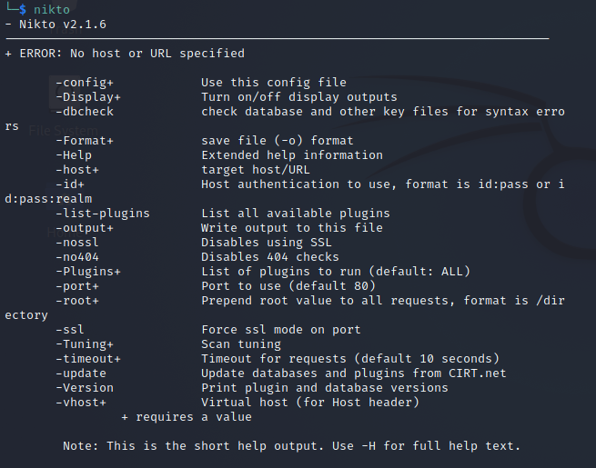

# Website Enumeration & Information Gathering

## 3. Nikto

### What is Nikto

Nikto is an Open Source (GPL) web server scanner which performs comprehensive tests against web servers for multiple items, including over 6700 potentially dangerous files/programs, checks for outdated versions of over 1250 servers, and version specific problems on over 270 servers. It also checks for server configuration items such as the presence of multiple index files, HTTP server options, and will attempt to identify installed web servers and software. Scan items and plugins are frequently updated and can be automatically updated.
Nikto is not designed as a stealthy tool. It will test a web server in the quickest time possible, and is obvious in log files or to an IPS/IDS. However, there is support for LibWhisker's anti-IDS methods, in case you want to give it a try (or test your IDS system).

1. Now open the terminal and write `nikto`.
   This will open the options for us
   

- The most important command that is `-host`

2. run this command to scan our OWASP machine
   nikto -host 192.168.1.85

- we got some target information 
      + Target IP: 192.168.1.85 + Target Hostname: 192.168.1.85 
      + Target Port: 80 + Start Time: 2021-09-12 12:13:02 (GMT3)

- and the server configurations and what is the version it is using 

      + Server: Apache/2.2.14 (Ubuntu) mod_mono/2.4.3 PHP/5.3.2-1ubuntu4.30 with Suhosin-Patch proxy_html/3.0.1 mod_python/3.3.1 Python/2.6.5 mod_ssl/2.2.14 OpenSSL/0.9.8k Phusion_Passenger/4.0.38 mod_perl/2.0.4 Perl/v5.10.1

- and here it's description each those version what is match to find it must be interesting for us 

      + The anti-clickjacking X-Frame-Options header is not present. 
      + The X-XSS-Protection header is not defined. This header can hint to the user agent to protect against some forms of XSS 
      + The X-XSS-Protection header is not defined. This header can hint to the user agent to protect against some forms of XSS

- it's show for us what the HTTP methods the server is use 

      + Allowed HTTP Methods: GET, HEAD, POST, OPTIONS, TRACE 
      + OSVDB-877: HTTP TRACE method is active, suggesting the host is vulnerable to XST

- and finally that show for us outputs about what is the directors 
      + OSVDB-3092: /phpmyadmin/changelog.php: phpMyAdmin is for managing MySQL databases, and should be protected or limited to aut 
      + OSVDB-3268: /test/: Directory indexing found. 
      + OSVDB-3092: /test/: This might be interesting... 
      + OSVDB-3268: /icons/: Directory indexing found. 
      + OSVDB-3268: /images/: Directory indexing found. 
      + OSVDB-3233: /icons/README: Apache default file found. 
      + /phpmyadmin/: phpMyAdmin directory found 
      + OSVDB-3092: /phpmyadmin/Documentation.html: phpMyAdmin is for managing MySQL databases, and should be protected or limited t

3. We can scan with the `-port` to know what the directors are open that port
   Write this command `nikto -host 192.168.1.85 -port 8081`
   you will get some result that we know it like 

         + The X-XSS-Protection header is not defined. This header can hint to the user agent to protect against some forms of XSS 
         + The X-XSS-Protection header is not defined. This header can hint to the user agent to protect against some forms of XSS

   but we got some interesting directors like 

         + OSVDB-3092: /admin/: This might be interesting... 
         + OSVDB-3092: /css/: This might be interesting... 
         + /admin/index.html: Admin login page/section found.
